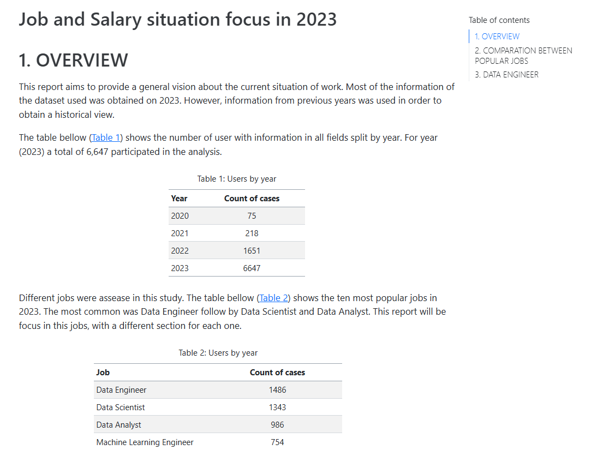

# job-salaries

The **aim** of this project is built a report describing the current situation of work market in jobs related with data and make comparations and predictions between the three most common jobs: Data Analyst, Data Scientist and Data Engineer.

  

---------------------------------

# Data base

The data base used can be found in: https://www.kaggle.com/datasets/lorenzovzquez/data-jobs-salaries

Other URL: https://ai-jobs.net/salaries/download/

---------------------------------

# Tools 

* Python
* Quarto 

---------------------------------

# Folders

**data**: You will founf two data bases:
- **20231108_rawData_salaries**. The database used in the same format that the author provide it.
- **20231108_rawData_salaries_sep**. Same database but seaparated by commas. Use it to explore the full data.

**src/python**:
- **time_series.py**. File with the sintaxis for time series technique.
- **two_ways_ANOVA.py**. File with the sintaxis for two ways ANOVA.

**reports**:
- **report.qmd**. File with the report sintaxis as well as the python code used to obtain the results.
- **report.html**. Report generated in html format.

