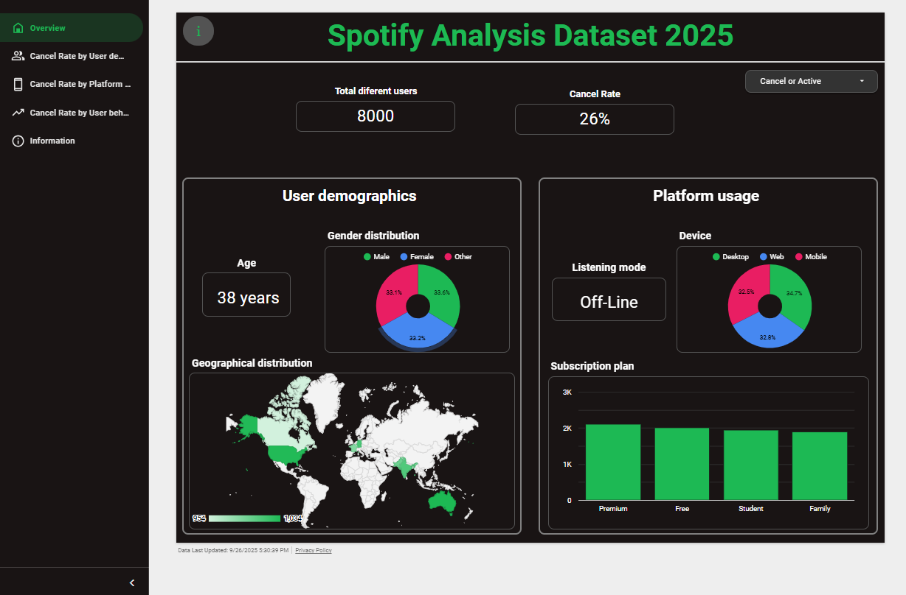

# Spotify-Analysis-Dataset-2025

This project explores Spotify user behavior to identify potential **churn patterns** (subscription cancellations).  
It includes two main components:  

1. An **interactive dashboard** with key insights.  
2. A **Jupyter Notebook** (`src/spotify_churn_analysis.ipynb`) containing Exploratory Data Analysis (EDA), feature engineering, predictive models, and conclusions.  

---

## 📈 Dashboard

Interactive visualization with demographic, behavioral, and churn insights:  
👉 [Open Dashboard](https://lookerstudio.google.com/reporting/6e200099-8129-4309-9782-7086efa24106/page/p_6q60818lwd)

<p align="center">
  
</p>

---

## 📊 Dataset

The dataset comes from Kaggle:  
[Spotify Dataset for Churn Analysis](https://www.kaggle.com/datasets/nabihazahid/spotify-dataset-for-churn-analysis)

- **Source**: Kaggle  
- **Dataset License**: [Apache 2.0 License](https://www.apache.org/licenses/LICENSE-2.0)  
- ⚠️ **Note**: This repository does **not** redistribute the dataset. To use it, please download it directly from Kaggle.  

---

## 📝 Notebooks

The full analysis is implemented in the `src/` folder:  
- File: `src/spotify_churn_analysis.ipynb`  
- Includes: data preparation, EDA, outlier detection, correlations, model training (Logistic Regression, Decision Tree, Random Forest, XGBoost), and conclusions.  
- Structure follows the outline below:  

   1. Introduction
   2. Configuration
   3. Exploratory Data Analysis (EDA)

      A. General

      B. Descriptive Statistics

      C. Outliers

      D. Normality Assumption

      E. Correlations
   4. Preprocessing and Feature Engineering
   5. Dataset Split
   6. Models

      A. Logistic Regression

      B. Decision Tree

      C. Random Forest

      D. XGBoost
   7. Conclusions


📌 The notebook is also available on Kaggle:  [Spotify 2025 — EDA & Prediction Models](https://www.kaggle.com/code/lauraalonso/spotify-2025-eda-prediction-models)  

---

## ⚙️ Installation & Usage

1. Clone this repository:
   ```bash
   git clone https://github.com/Laura-Alonso/Spotify-Analysis-Dataset-2025.git
2. Create a virtual environment (recommended).
3. Install dependencies.
   ```bash
   pip install -r requirements.txt
   